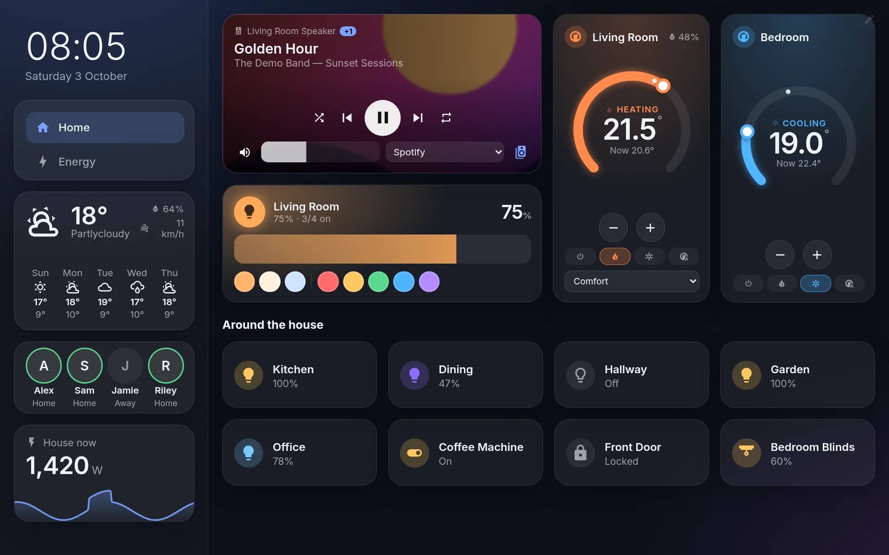
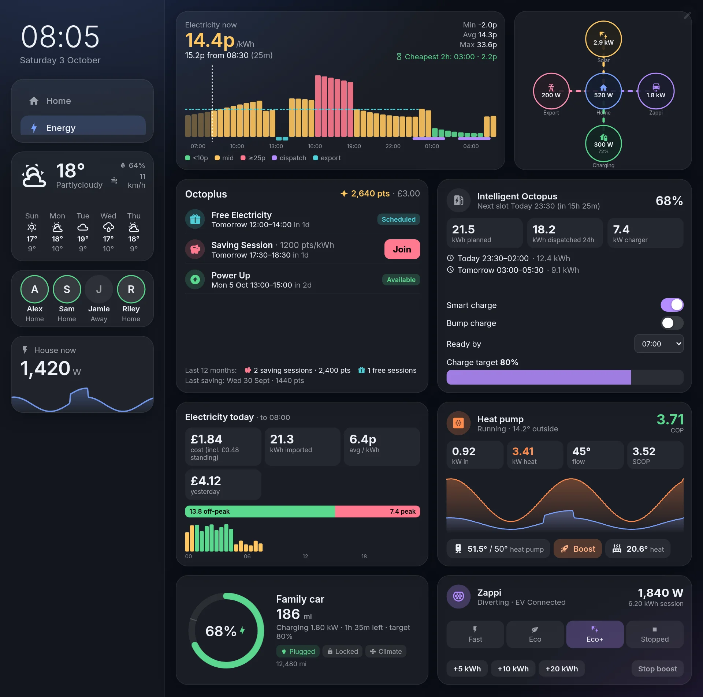
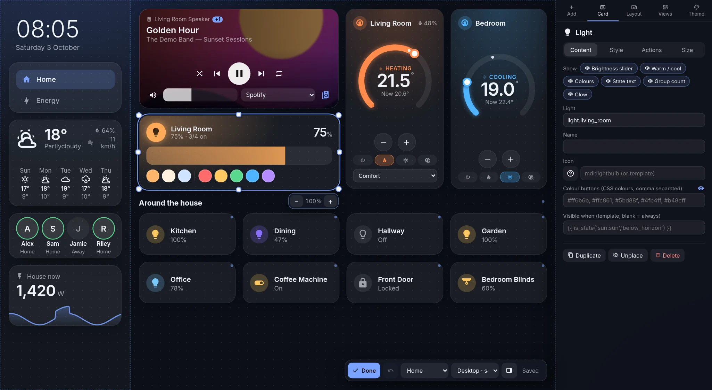
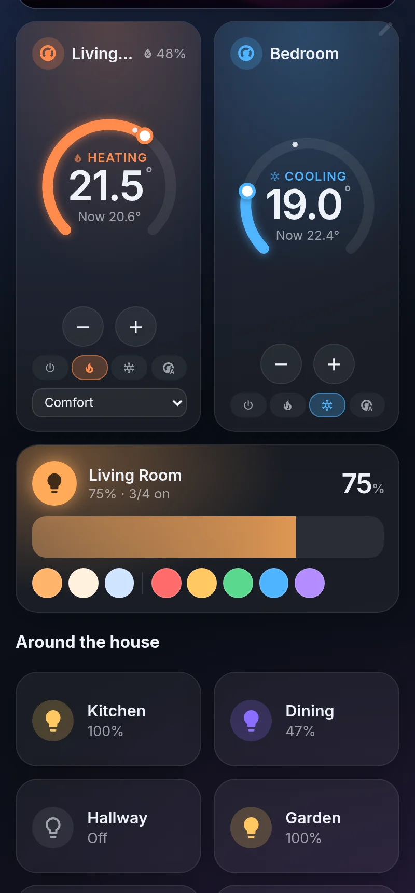

<p align="center"></p>

<p align="center"><b>A glassy, fast, drag-and-drop dashboard for Home Assistant.</b><br>
Put any card anywhere, make it any size, style it any way — and run it on a wall tablet, phone or desktop.</p>

<p align="center"></p>

---

## Why Glasshouse?

Glasshouse is a Home Assistant **add-on** that gives you a dashboard you design in the browser — no YAML, no grid. It was inspired by [ha-fusion](https://github.com/matt8707/ha-fusion), and goes further on layout freedom, styling and energy data.

- **Free layout** — drag cards anywhere and drag any edge or corner to resize. Cards snap to each other's edges and sizes (with guide lines) and to a grid; hold Shift for pixel precision.
- **Sidebar** — an optional sidebar that stays put while you switch views; cards move freely between sidebar and main area.
- **One layout, every screen** — design once for your wall tablet; desktops show it scaled, phones get an automatic single-column version. Give any device its own custom layout if you want.
- **Made for wall tablets** — *fit the whole view on screen* (no scrolling), a kiosk mode that hides Home Assistant's header bar, and **live updates**: save on your laptop and every tablet updates within a second. After an add-on update, open screens reload themselves.
- **Templates everywhere** — any text, icon, colour or style can be a live Home Assistant template (`{{ states('sensor.x') }}`), and any card can be shown or hidden by a template.
- **Style anything** — background, colours, radius, border, shadow, glass blur, fonts, custom CSS, per card or for the whole theme, plus a **− / +** to scale everything inside a card.
- **Pop-ups & actions** — tap / hold to toggle, open a detailed pop-up, open a pop-up of other cards, change view, call a service or open a URL.
- **Groups & multi-select** — rooms move as one; select several cards to group, align or size them together. Undo, duplicate, keyboard nudging.
- **Fast** — a ~75 KB (gzipped) Svelte app that only subscribes to the entities your cards use.

## Energy, front and centre

<p align="center"></p>

First-class cards for UK energy setups, with entities **auto-detected** when you add them:

| Card | What it shows |
|---|---|
| **Octopus rates** | Price now and next, cheapest 2-hour window, half-hourly bars (Agile, Go, Intelligent) with export rate, Intelligent dispatches and Octoplus sessions overlaid |
| **Octoplus sessions** | Live Saving Session / Power Down banner with baseline vs usage, upcoming Saving Sessions, Power Ups and Free Electricity with **Join** buttons, points and 12-month stats |
| **Intelligent Octopus** | Dispatch status, planned and recent slots, smart / bump charge, ready-by time, charge target |
| **Energy cost today** | Cost, kWh, average p/kWh, export, solar, yesterday, peak/off-peak split, half-hourly usage coloured by rate |
| **Power flow** | Solar, grid, battery, home and EV with animated flows |
| **Home battery** | Charge %, kWh left, charge / discharge power, time to full or to reserve, health, today in / out (SolarEdge auto-detected) |
| **Predbat** | What Predbat is doing, the 24-hour charge / export plan with predicted battery %, costs and savings, Charge / Export / Hold now |
| **Heat pump** | Live COP / SCOP, power in and heat out, flow and outdoor temperature, hot water with Boost |
| **Zappi / Eddi** | Status, charge-mode buttons, boosts (myenergi) |
| **Electric vehicle** | Battery vs target, range, charging, plug / lock / climate (Audi, VW, Renault and similar integrations) |

Built for the [Octopus Energy](https://github.com/BottlecapDave/HomeAssistant-OctopusEnergy) and [myenergi](https://github.com/CJNE/ha-myenergi) integrations. Every card lets you show or hide each of its sections.

## Edit in the browser

<p align="center"></p>

Press the faint pencil (or **E**) to edit. Add cards from the panel, drag and resize them on the canvas, and change content, style, actions and size on the right. Every card's settings form is generated from the card itself, so nothing needs YAML.

<table><tr>
<td width="38%"></td>
<td>

### On your phone

Phones get an automatic single-column version of your main layout: navigation across the top, rooms kept together, small cards paired two-per-row. Switch phone (or desktop) to a custom layout any time.

### All the cards

Button / tile · Light · Thermostat (draggable dial) · Media player (artwork, volume, source, speaker grouping) · Cover / blind · Slider · Option picker · Entities list · Glance · Sensor with graph · Gauge · History graph · Weather · Clock · Text / Markdown · Template lines · People · Camera · Web page · Image · Navigation · Divider · Alarm panel · and the energy cards above.

### Coming from ha-fusion?

**Layout → Import from ha-fusion** rebuilds your ha-fusion dashboard — views, rooms, buttons (their templates keep working), cameras and sidebar — and adds an Energy view.

</td>
</tr></table>

## Install

1. In Home Assistant go to **Settings → Add-ons → Add-on Store → ⋮ → Repositories** and add  
   `https://github.com/leacho73/glasshouse`
2. Install **Glasshouse**, start it and turn on **Show in sidebar**.
3. Open **Glasshouse** from the sidebar and press **E** to start building.

Wall tablet tips: set **Layout → Main → Sizing** to *Fit the whole view on screen* and tick *Hide Home Assistant's header bar*, or add `?device=tablet&fit=screen&kiosk` to the tablet's URL.

## Develop

```sh
cd glasshouse/app && npm install
HA_URL=http://<your-ha>:8123 HA_TOKEN_FILE=<file with a long-lived token> npm run server   # :8099
npm run dev                                                                                  # Vite on :5173
```

### Adding a card type

Drop a `.svelte` file into `glasshouse/app/src/cards/` that exports a `meta` object from `<script module>`:

```js
export const meta = {
  type: 'my-card', name: 'My card', icon: 'mdi:star', category: 'Info',
  size: { w: 240, h: 140 },
  fields: [{ key: 'entity', label: 'Entity', type: 'entity' }],   // builds the editor form
  sections: [{ key: 'graph', label: 'Graph' }],                     // optional show/hide chips
  autofill: () => ({ entity: find(/^sensor\.my_integration_/) }),   // optional auto-detection
};
```

Use `t()` / `ent()` from `lib/tpl.js` so every setting can be a template. Release by bumping `version` in `glasshouse/config.yaml` and adding a `CHANGELOG.md` entry.

*Screenshots use a demo house with made-up entities.*
