<p align="center"></p>

<p align="center"><a href="https://github.com/leacho73/panalume/releases"></a></p>

<p align="center"><b>A glassy, fast, drag-and-drop dashboard for Home Assistant.</b><br>
Put any card anywhere, make it any size, style it any way — and run it on a wall tablet, phone or desktop.<br><sub>Formerly <i>Glasshouse</i>.</sub></p>

<p align="center"></p>

<p align="center"><a href="https://youtu.be/hPoqwze7i7k">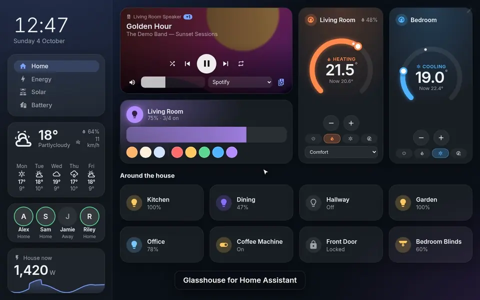</a><br><sub>▶ <a href="https://youtu.be/hPoqwze7i7k">Watch the 1½-minute demo on YouTube</a>: the wall tablet, energy, solar, sun and moon, around the house, editing in the browser and the phone layout.</sub></p>

---

## Why Panalume?

Panalume is a Home Assistant **app** that gives you a dashboard you design in the browser — no YAML, no grid. It was inspired by [ha-fusion](https://github.com/matt8707/ha-fusion), and goes further on layout freedom, styling and energy data.

- **Free layout** — drag cards anywhere and drag any edge or corner to resize. Cards snap to each other's edges and sizes (with guide lines) and to a grid, and a **magnet** keeps cards joined at your usual gap: make one taller and the cards below move down, drop one into a column and it slots in. Hold Shift for pixel precision.
- **Sidebar** — an optional sidebar that stays put (and keeps its size) while you switch views; cards move freely between sidebar and main area. Turn it off and its cards are kept for later.
- **One layout, every screen** — design once for your wall tablet; desktops show it scaled, phones get an automatic single-column version. Give any device its own custom layout if you want.
- **Made for wall tablets** — *fit the whole view on screen* (no scrolling), a kiosk mode that hides Home Assistant's header bar, and **live updates**: save on your laptop and every tablet updates within a second. After an app update, open screens reload themselves.
- **Templates everywhere** — any text, icon, colour or style can be a live Home Assistant template (`{{ states('sensor.x') }}`), and any card can be shown or hidden by a template.
- **Style anything** — background, colours, radius, border, shadow, glass blur, fonts, custom CSS, per card or for the whole theme, plus a **− / +** to scale everything inside a card.
- **Pop-ups & actions** — tap / hold to toggle, open a detailed pop-up, open a pop-up of other cards, change view, call a service or open a URL.
- **Groups & multi-select** — rooms move as one; select several cards to group, align, size or space them evenly, or show / hide the same part on all of them at once. Copy cards to another view. Undo, duplicate, keyboard nudging.
- **Fast** — a ~75 KB (gzipped) Svelte app that only subscribes to the entities your cards use.

## Energy, front and centre

<p align="center"></p>

First-class cards for UK energy setups, with entities **auto-detected** when you add them:

| Card | What it shows |
|---|---|
| **Octopus rates** | Price now and next (FREE during Free Electricity and Power Ups, with Saving Session rewards), cheapest 2-hour window, half-hourly bars (Agile, Go, Intelligent) with export rate, Intelligent dispatches and Octoplus sessions overlaid |
| **Octoplus sessions** | Live Saving Session / Power Down banner with baseline vs usage, upcoming Saving Sessions, Power Ups and Free Electricity with **Join** buttons, points and 12-month stats |
| **Intelligent Octopus** | Dispatch status, planned and recent slots, smart / bump charge, ready-by time, charge target |
| **Energy usage** | Home Assistant's energy graph, live: hourly grid / solar / battery / export bars, today's totals, cost and earnings, price paid per hour, what the house is using now |
| **Energy cost today** | Cost, kWh, average p/kWh, export, solar, yesterday, peak/off-peak split, half-hourly usage coloured by rate |
| **Solar** | Generating now, today's curve against the Solcast forecast, above / below forecast, where it's going, tomorrow and the week ahead |
| **Energy flow** | Self-powered %, solar / battery / house figures and a live flow chart of every route power is taking |
| **Power flow** | Solar, grid, battery, home and EV with animated flows |
| **Home battery** | Charge %, kWh left, charge / discharge power, time to full or to reserve, health, today in / out (SolarEdge auto-detected) |
| **Predbat** | What Predbat is doing, the 24-hour charge / export plan with predicted battery %, costs and savings, Charge / Export / Hold now |
| **Heat pump** | Live COP / SCOP, power in and heat out, flow and outdoor temperature, hot water with Boost |
| **Zappi / Eddi** | Status, live power (each device's own reading), session kWh, charge-mode buttons, boosts, and how much of Intelligent Octopus Go's 6 cheap charging hours are left (myenergi) |
| **Electric vehicle** | Battery vs target, range, charging, plug / lock / climate (Audi, VW, Renault and similar integrations) |

<p align="center">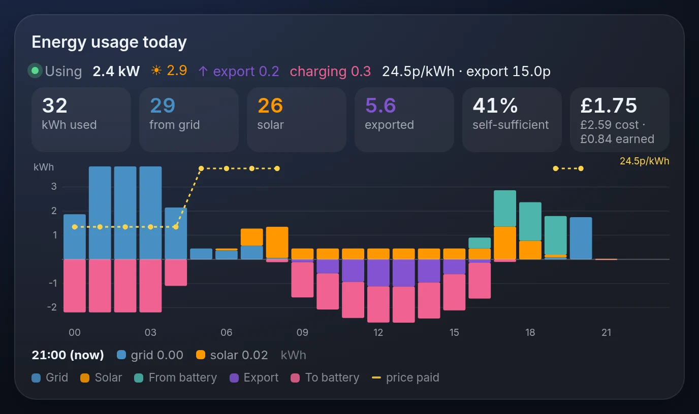<br><sub><b>Energy usage</b>: where today's energy came from and went, hour by hour, with cost, earnings and the price paid, updating live.</sub></p>

<table><tr>
<td width="50%">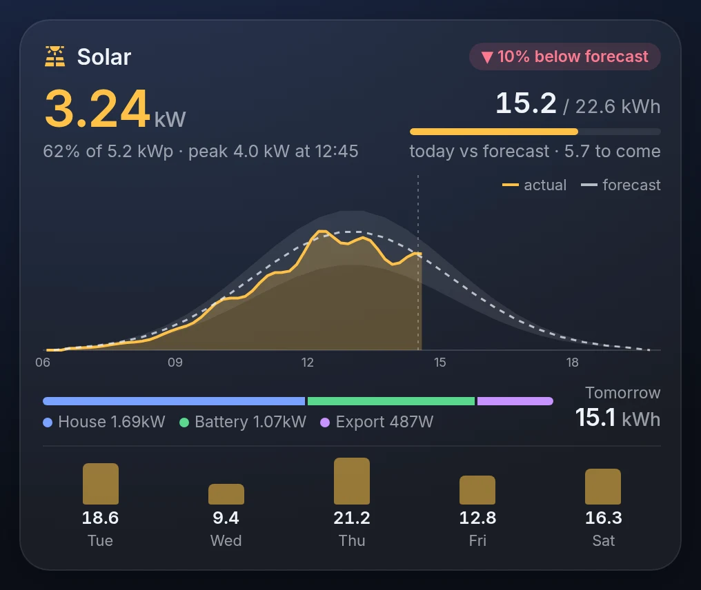<br><sub><b>Solar</b>: generating now, today's output over the Solcast forecast and its likely range, where it's going, tomorrow and the next five days.</sub></td>
<td width="50%">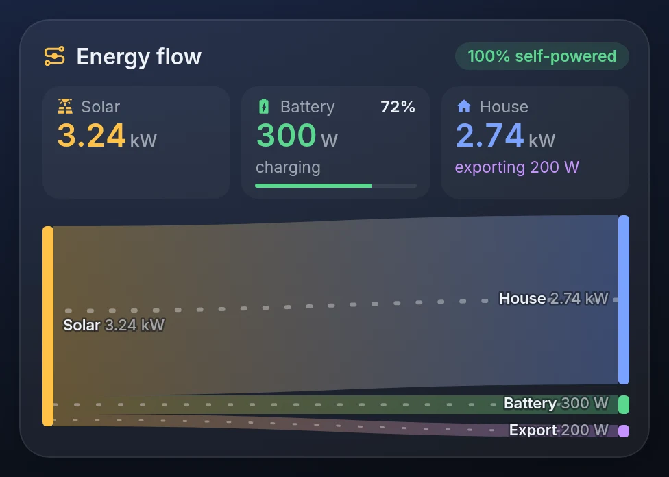<br><sub><b>Energy flow</b>: how self-powered the house is, and a live chart of power from solar, battery and grid to the house, battery and export.</sub></td>
</tr></table>

<table><tr>
<td width="50%">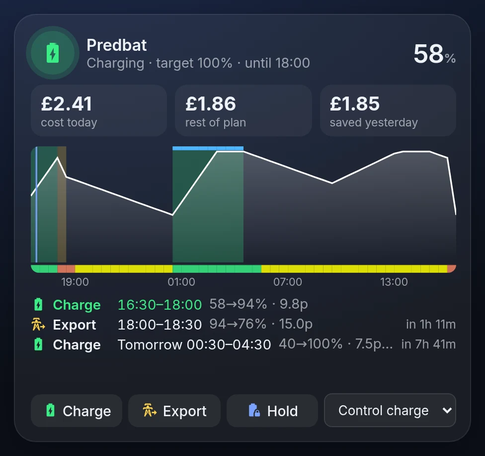<br><sub><b>Predbat</b>: what it's doing now, the next 24 hours of charge / export slots with predicted battery %, costs, and Charge / Export / Hold buttons.</sub></td>
<td width="50%">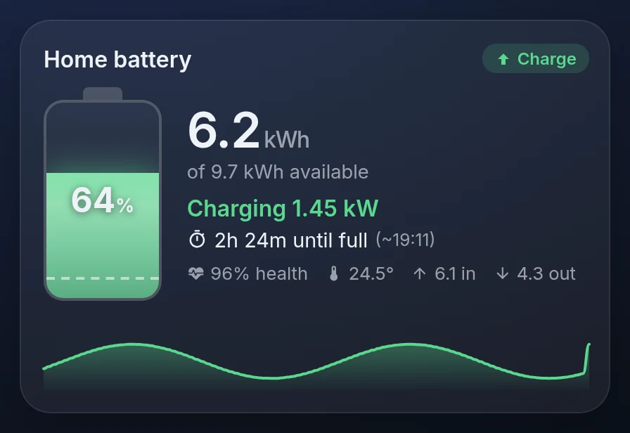<br><sub><b>Home battery</b>: charge, kWh left, charging power, time until full or until your backup reserve, health, temperature and a 24-hour graph.</sub></td>
</tr></table>

Built for the [Octopus Energy](https://github.com/BottlecapDave/HomeAssistant-OctopusEnergy), [myenergi](https://github.com/CJNE/ha-myenergi), [Predbat](https://github.com/springfall2008/batpred) and SolarEdge Modbus Multi integrations. Every card lets you show or hide each of its sections.

## Around the house

<table><tr>
<td width="50%">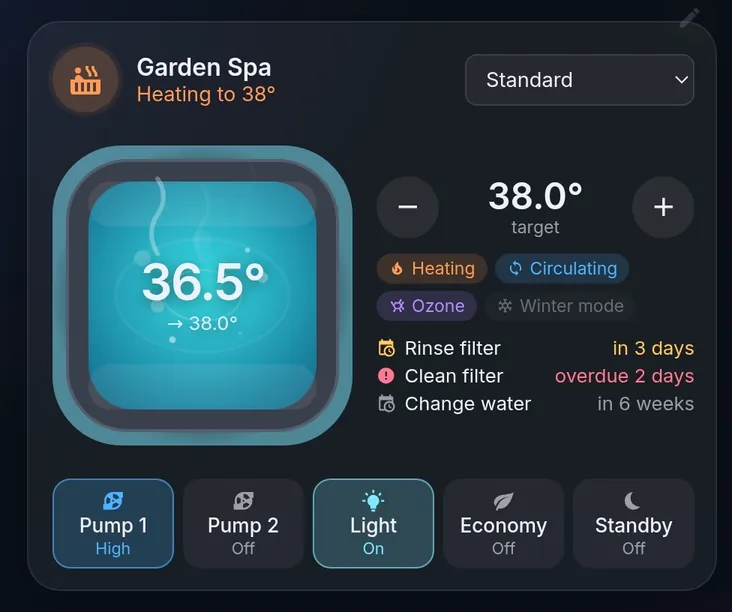<br><sub><b>Hot tub</b>: water that warms in colour, bubbles with the pumps and steams while heating; target − / +, pumps, light, WaterCare mode, status lights and filter / water-change reminders (Gecko spas detected automatically).</sub><br><br>
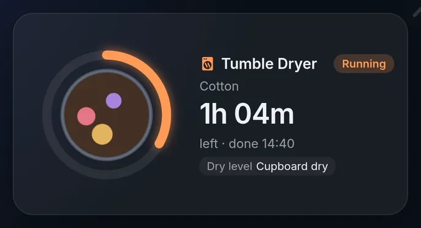<br><sub><b>Tumble dryer</b>: a drum that tumbles, programme, time left and finish time, dry level.</sub></td>
<td width="50%">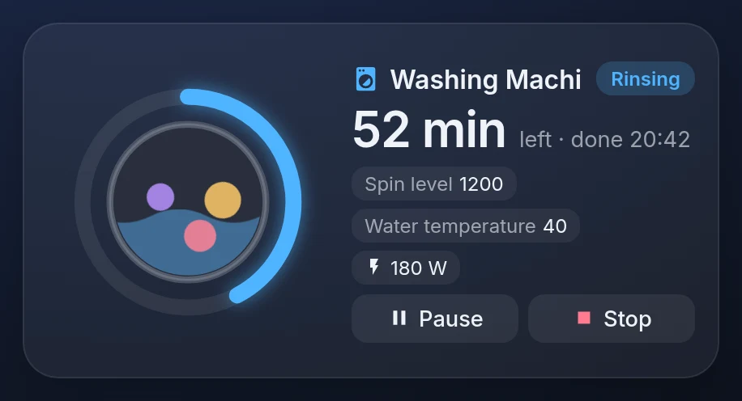<br><sub><b>Washing machine</b>: a drum that turns (fast on the spin), time left and finish time, phase, spin and temperature, leak sensor, Pause / Stop.</sub><br><br>
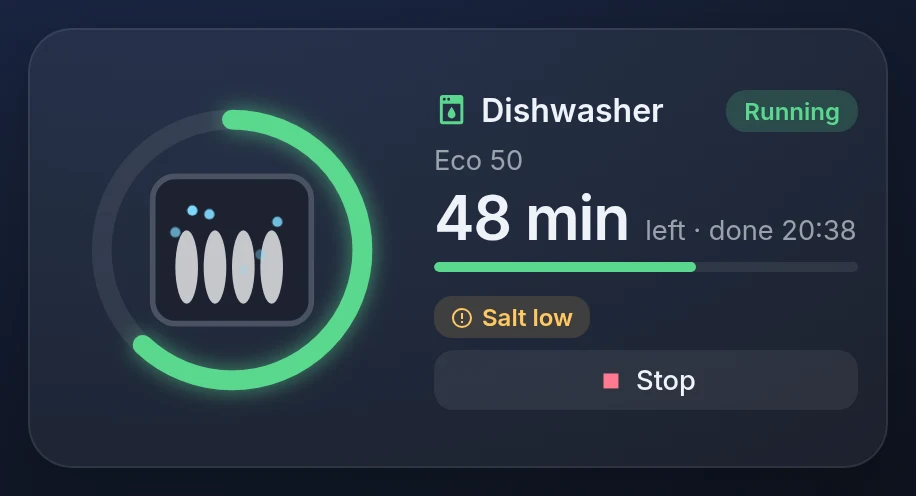<br><sub><b>Dishwasher</b>: programme, progress, time left, salt / rinse aid low.</sub></td>
</tr></table>

Detects Samsung SmartThings washers, Home Connect (Bosch / Neff / Siemens) dishwashers, hOn (Haier / Candy / Hoover) dryers and Gecko (in.touch2) hot tubs; any other appliance can be set up by picking its entities.

<table><tr>
<td width="62%">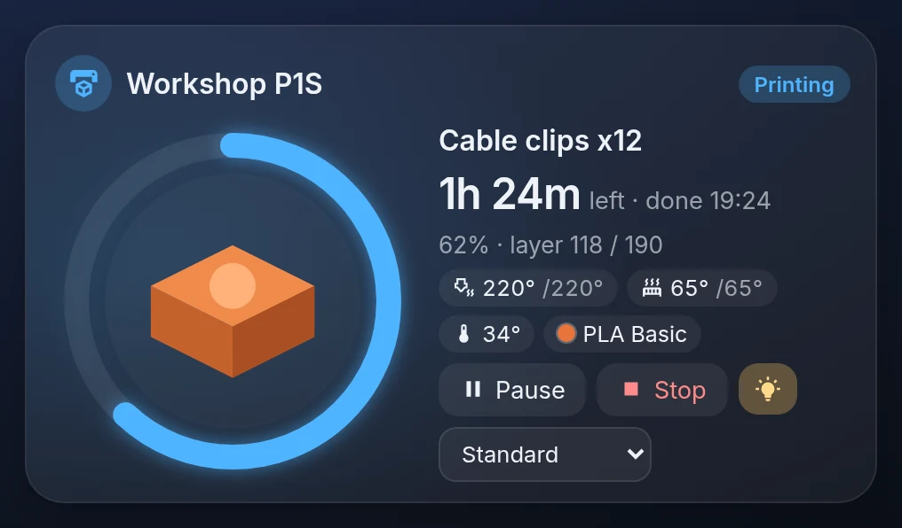<br><sub><b>3D printer</b>: progress ring around the model, time left and finish time, layers, nozzle / bed / chamber temperatures, filament colour, Pause / Resume / Stop, light and speed (Bambu Lab printers detected automatically; OctoPrint too).</sub></td>
<td width="38%">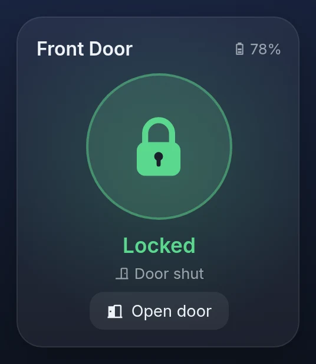<br><sub><b>Door lock</b>: a padlock whose shackle lifts when unlocked; tap to lock, tap twice to unlock; door sensor, battery and Open door.</sub></td>
</tr></table>

<p align="center">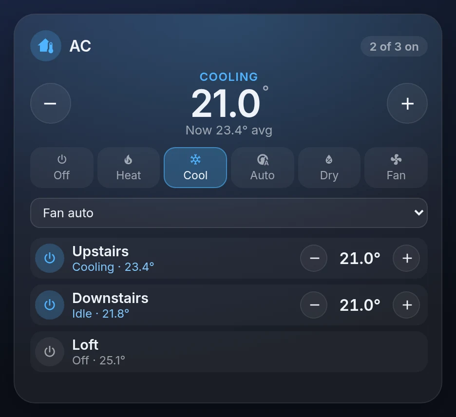<br><sub><b>Climate group</b>: upstairs and downstairs AC (or any thermostats) from one card: one target, mode and fan speed for all of them, and a row per unit to switch it or adjust it on its own.</sub></p>

## Edit in the browser

<p align="center"></p>

Press the faint pencil (or **E**) to edit. Add cards from the panel, drag and resize them on the canvas, and change content, style, actions and size on the right. Every card's settings form is generated from the card itself, so nothing needs YAML.

<table><tr>
<td width="38%"></td>
<td>

### On your phone

Phones get an automatic single-column version of your tablet layout: navigation across the top, rooms kept together, small cards paired two-per-row. Switch phone (or desktop) to a custom layout any time; on the phone, deleting a card closes the gap it leaves.

### All the cards

Button / tile · Light · Thermostat (draggable dial) · Climate group (several thermostats / AC units at once) · Door lock · 3D printer · Hot tub · Washing machine · Tumble dryer · Dishwasher · Media player (artwork, volume, source, speaker grouping) · Cover / blind · Slider · Option picker · Entities list · Glance · Sensor with graph · Gauge · History graph · Weather · Clock · Sun & moon (sunrise / sunset, moon phase, moonrise / moonset) · Text / Markdown · Template lines · People · Camera (tap for full-screen live view) · Web page · Image · Navigation · Divider · Alarm panel · and the energy cards above.

### Coming from ha-fusion?

**Layout → Import from ha-fusion** rebuilds your ha-fusion dashboard — views, rooms, buttons (their templates keep working), cameras and sidebar — and adds an Energy view.

</td>
</tr></table>

## Install

> **Beta:** Panalume is in beta until 1.0: used every day, but expect changes. Please report problems and ideas in [Issues](https://github.com/leacho73/panalume/issues). Each update has [release notes](https://github.com/leacho73/panalume/releases).

1. In Home Assistant go to **Settings → Apps → App Store → ⋮ → Repositories** and add  
   `https://github.com/leacho73/panalume`
2. Install **Panalume**, start it and turn on **Show in sidebar**.
3. Open **Panalume** from the sidebar and press **E** to start building.

Wall tablet tips: set **Layout → Tablet → Sizing** to *Fit the whole view on screen* and tick *Hide Home Assistant's header bar*. Or add options to the tablet's URL:

| Option | Does |
|---|---|
| `?device=tablet` / `phone` / `desktop` | Use that device's layout |
| `?fit=screen` / `width` / `actual` | Fit the view on screen, fill the width, or actual size |
| `?kiosk` | Hide Home Assistant's header bar |
| `?view=Upstairs` | Open on this view (name or id) |
| `?return=5` | Go back to that view after 5 minutes without a touch |
| `?noedit` | Hide the edit pencil and the E shortcut |

e.g. `…/panalume?view=Upstairs&return=5&noedit&fit=screen&kiosk`

## Develop

```sh
cd panalume/app && npm install
HA_URL=http://<your-ha>:8123 HA_TOKEN_FILE=<file with a long-lived token> npm run server   # :8099
npm run dev                                                                                  # Vite on :5173
```

### Adding a card type

Drop a `.svelte` file into `panalume/app/src/cards/` that exports a `meta` object from `<script module>`:

```js
export const meta = {
  type: 'my-card', name: 'My card', icon: 'mdi:star', category: 'Info',
  size: { w: 240, h: 140 },
  fields: [{ key: 'entity', label: 'Entity', type: 'entity' }],   // builds the editor form
  sections: [{ key: 'graph', label: 'Graph' }],                     // optional show/hide chips
  autofill: () => ({ entity: find(/^sensor\.my_integration_/) }),   // optional auto-detection
};
```

Use `t()` / `ent()` from `lib/tpl.js` so every setting can be a template. Release by bumping `version` in `panalume/config.yaml` and adding a `CHANGELOG.md` entry.

*Screenshots and the demo video use a demo house with made-up entities.*
